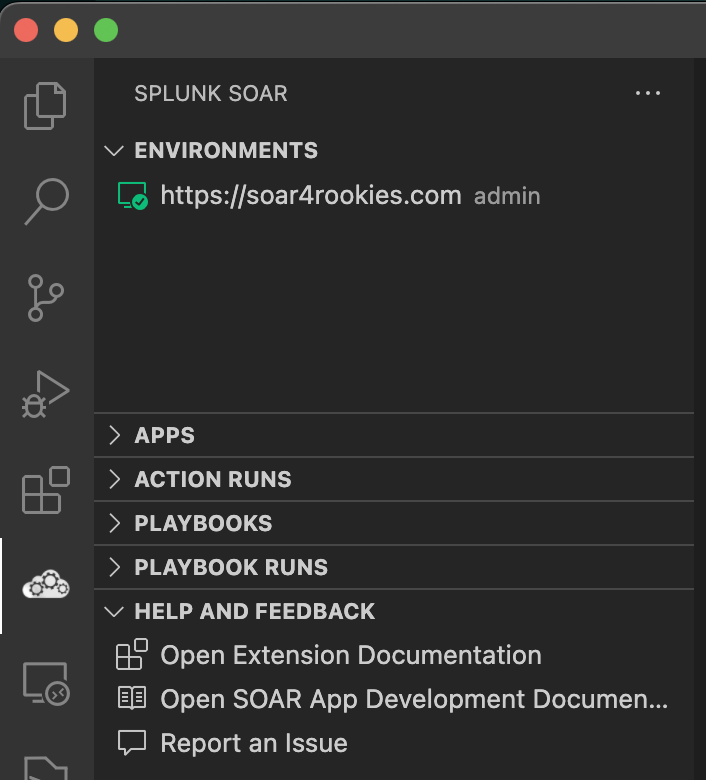
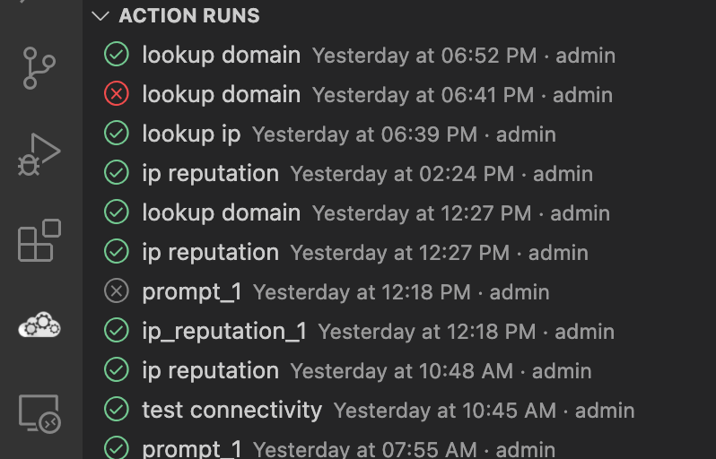
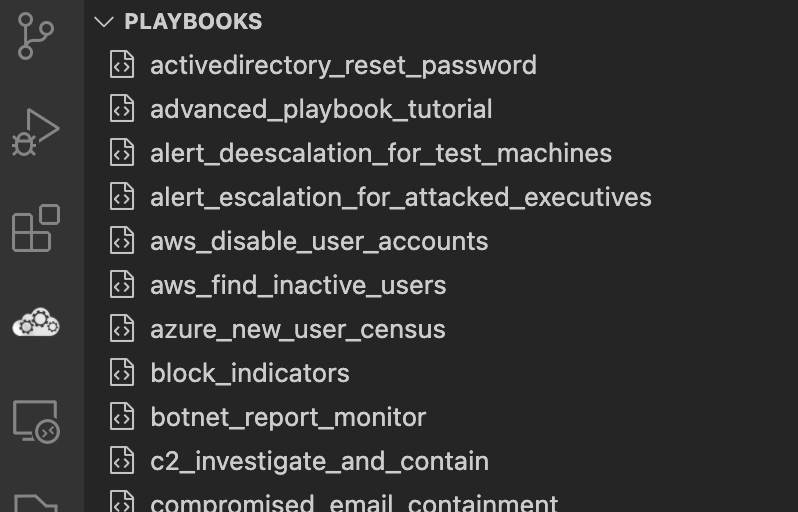
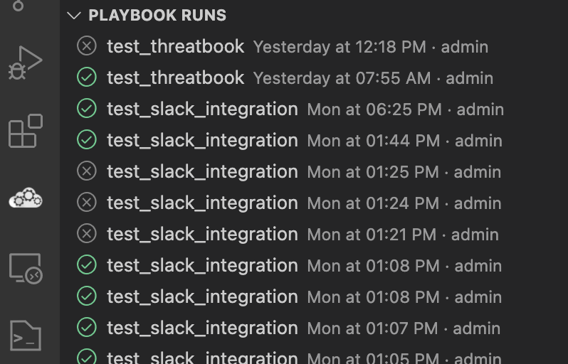
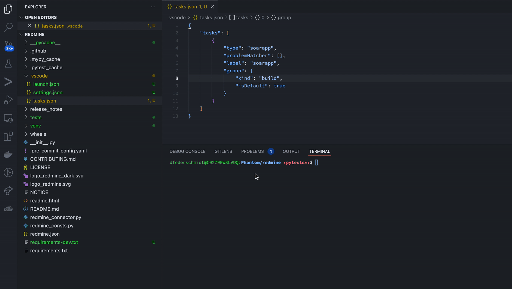
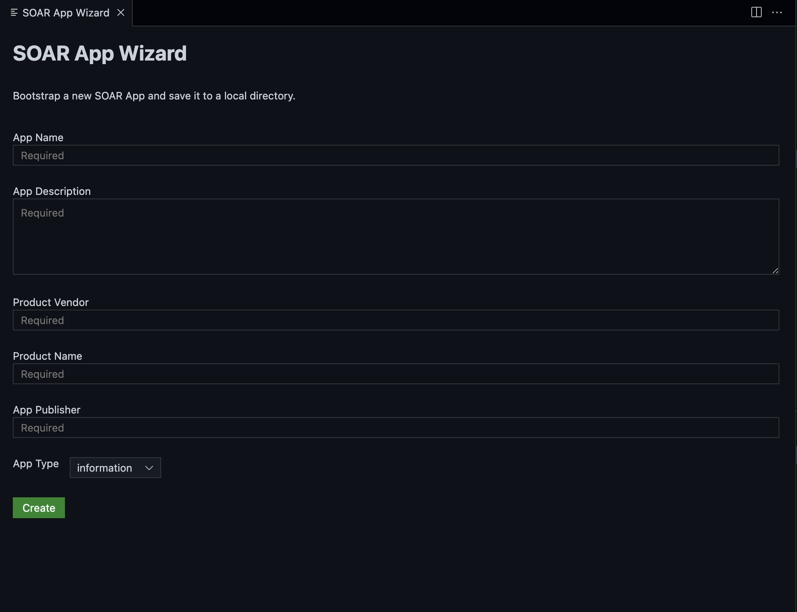

# Splunk SOAR Extension for VS Code

The extension for developers building applications for Splunk SOAR. Works with SOAR hosted on-prem or in Cloud and its goal is to make the app development experience as seamless and efficient as possible on the [VS Code](https://code.visualstudio.com/) editor platform. 

During setup, the extension is configured to connect to the SOAR platform. This allows the extension to pull information from SOAR and allows the developer to perform common operations such as browsing of remote objects, running actions and managing resulting action runs. 

All features are targeted towards speeding up SOAR app development. Explicitly out-of-scope are features that assist with playbook development. For developing playbooks, the new Visual Playbook Editor (VPE) within SOAR is strongly recommended.

Features include

- Built-in [**App Wizard**](#app-wizard) to bootstrap a new local SOAR App project
- New SOAR sidebar views to provide information and quick actions throughout the development process
    - [**SOAR Apps view**](#apps-view) - Browse installed apps, actions and assets. Run SOAR actions using a step-by-step interactive dialog
    - [**SOAR Action Runs view**](#action-runs-view) - Browse past and current action runs. Trigger new action runs based on prior executions
- A set of useful [**SOAR commands**](#soar-commands)
    - Browse remote SOAR objects such as Containers, Assets, Apps
    - Navigate to SOAR Web UI
- a custom [**SOAR App Build Task**](#app-build-task) to install a local SOAR app on the configured instance with a single key combination
- a smart [**Run Action CodeLens**](#run-action-codelens) that detects action handlers in connector code and provides an inline action command

## Installation

Download the extension via the Visual Studio Marketplace. 

Alternatively, download the VSIX file from the [Releases page](https://github.com/splunk/vscode-extension-splunk-soar/releases/) and use the *Extensions -> Install from VSIX...* dialog within the VS Code extension panel.

## Connect your environment

After successful installation, open the Splunk SOAR view from the sidebar and press the **Connect Environment** button to set up the connection to your SOAR environment. 

<p align="center">
  
</p>

After the environment is set up, it will be activated automatically. You're able to connect multiple environments but only a single environment can be active at any point in time.

# Features

## Multi-Environment Support

<p align="center">
  
</p>

It's possible to create multiple environments to quickly context-switch between remote SOAR instances. Only a single environment can be active at the same time. Use the available context menus to manage environments and receive information about them.

## Side Bar Views

Splunk SOAR ships with many side bar views to provide features that make SOAR App Development quicker.

<p align="center">
  
</p>

Take note that there is a dedicated view for help and feedback in case you experience any difficulties with this extension.

### Apps View

<p align="center">
  
</p>

The Apps view provides actions to manage and interact with installed apps on the SOAR environment. It provides

- Ability to review all installed apps, assets and provided actions 
- Capability to execute actions on the installed apps
- Browse files deployed within apps
  - Compare remote files with a opened local file

### Action Runs View

<p align="center">
  
</p>

The Action Runs view provides means to manage and review current and prior runs

- Ability to get information about past runs
- An inline menu to cancel an ongoing run
- An inline menu to re-run a prior action run with identical parameters

### Playbooks View

<p align="center">
  
</p>

The Playbooks view provides means to review Playbooks

- Quickly run a Playbook from VS Code
- Open and Inspect the Playbook in the SOAR Visual Playbook Editor
- Review Playbook metadata 

### Playbook Runs View

<p align="center">
  
</p>

The Playbooks Runs view provides means to manage and review current and prior runs

- Ability to get information about past runs
- An inline menu to cancel an ongoing run


## Hover Information

<p align="center">
  
</p>

Hovering over Playbook Runs and Action Runs views shows additional contextual information which provides quick links for inspecting the elements.

## App Installation

<p align="center">
  
</p>

Using the [TaskProvider API](https://code.visualstudio.com/api/extension-guides/task-provider) the extension provides a Task that allows to install a local app to the configured SOAR instance via REST API. This procedure works for both on-prem and cloud SOAR. The task will transparently create a tar bundle of the app code for and upload it  to the instance.

## App Wizard

<p align="center">
  
</p>

The App Wizard allows to quickly scaffold a new SOAR App, similar to the App Wizard in the SOAR Web UI. After generation, the user will be asked for the directory where the new project should be saved and the project is opened in a new editor window.

## Inspecting SOAR Objects

<p align="center">
  
</p>

By providing a [Tree View](https://code.visualstudio.com/api/extension-guides/tree-view), the extension allows to browse apps and assets configured on the connected SOAR instance. Using [Virtual Documents](https://code.visualstudio.com/api/extension-guides/virtual-documents), users are able to review SOAR objects in JSON format on-the-fly. Note that these views are read-only.[](media/appinstall.gif)

## Running Actions

<p align="center">
  
</p>

Within the SOAR Apps view, there is a contextual control to run an action in the connected SOAR instance from within VS Code. An interactive dialog allows the user to provide the actions parameters as well as the desired execution context (asset, container). After triggering the execution, the extension will poll for the action to complete and pipe the generated result back into the VS Code Output terminal.

# Extension Settings

|  Name | Description  |
|---|---|
| `actionRuns.showOwnOnly`  |  Specifies whether to filter the Action Runs view to only show actions executed by the configured user  |
| `playbookRuns.showOwnOnly`  |  Specifies whether to filter the Playbook Runs view to only show actions executed by the configured user  |
| `apps.showConfiguredOnly`  |  Specifies whether to filter the Apps view to only show apps that have at least one asset configured  |
| `runAction.timeout`  | Specifies the timeout in seconds for action executions |
| `codeLensEnabled`  | Specifies whether or not to show place inline CodeLens hints to quickly run actions on top of action handlers |
|   |   |

# Contributing
## Requirements
* `yarn` or `npm` installed
* Open this repo in a clean VS Code workspace

## Running the Extension
* Install the dependencies on the first run by executing in Terminal
```bash
$ npm install
# or
$ yarn install
```
* Run the `Run Extension (vscode-extension-splunk-soar)` target in the `Run and Debug` view. This will:
    * Start a task `npm: watch` to compile the code
        > NOTE: click on `Debug Anyway` when prompted by a warning popup 
    * Run the extension in a new VS Code window

# Support & License

Please refer to [License](LICENSE) with regards to licensing. This software is released as-is. Splunk provides no warranty and no support on this software. If you have any issues with the software, please file an issue on the repository.