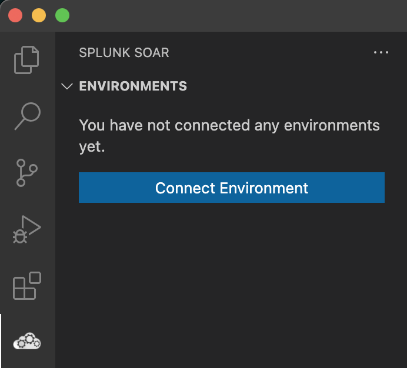

# Splunk SOAR Extension for VS Code

The extension for developers building applications for Splunk SOAR. Works with SOAR hosted either on-prem or in Cloud and its goal is to make the app development experience as seamless and efficient as possible on the [VS Code](https://code.visualstudio.com/) editor platform.

During setup, the extension is configured to connect to the SOAR platform. This allows the extension to pull information from SOAR and allows the developer to perform common operations such as browsing of remote objects, running actions and managing resulting action runs.

The screenshots below are taken from the [Visual Studio Code](https://github.com/microsoft/vscode) environment
where the extension is installed successfully.

## Features
* Browse apps and assets configured on the connected SOAR instance via [Tree View](https://github.com/splunk/vscode-extension-splunk-soar/wiki/features#inspect-soar-objects)
* [Apps Installation](#app-installation) via custom [SOAR App Build Task](https://github.com/splunk/vscode-extension-splunk-soar/wiki/features#app-build-task) to install a local SOAR app on the configured instance with a [single key combination](https://github.com/splunk/vscode-extension-splunk-soar/wiki/commands#installing-an-app-using-the-command-palette)
* Integrated [Actions Execution](#run-actions) to run a given action on the configured instance
* Integrated [Playbooks Execution](#run-playbooks) to run a given playbook on the configured instance
* Built-in [App Wizard](https://github.com/splunk/vscode-extension-splunk-soar/wiki/features#app-wizard) to bootstrap a new local SOAR App project
* Smart [Run Action CodeLens](https://github.com/splunk/vscode-extension-splunk-soar/wiki/features#run-action-codelens) to detect action handlers in connector code and provide an inline action command
* Set of useful [SOAR commands](https://github.com/splunk/vscode-extension-splunk-soar/wiki/commands) aiming to
  * Browse remote SOAR objects such as Containers, Assets, Apps
  * Navigate to SOAR Web UI
* Integrated [SOAR: Container Watcher Console](https://github.com/splunk/vscode-extension-splunk-soar/wiki/features#container-watcher-console) to watch containers for changes at either action or playbook execution

:warning: All features are targeted towards speeding up SOAR apps development. Explicitly out-of-scope are features assisting with playbook development. For developing playbooks, the new Visual Playbook Editor (VPE) within SOAR is strongly recommended.

## Getting Started
### Installation

Download the extension via the Visual Studio Marketplace.

Alternatively, download the VSIX file from the [Releases page](https://github.com/splunk/vscode-extension-splunk-soar/releases/) and use the *Extensions -> Install from VSIX...* dialog within the VS Code extension panel.

### Connect your environment

After successful installation, open the Splunk SOAR view from the sidebar and press the **Connect Environment** button to set up the connection to your SOAR environment. Type info such as SOAR URL and credentials to the appearing step-by-step interactive dialog. Once the environment is set up, it will be activated automatically.

<p align="center">
  
</p>

Use the available context menu to manage environment(s) and receive information about them. To open the context menu, right-click on the desired environment listed in the view.

#### Multi-Environment Support

You can create multiple environments to quickly context-switch between remote SOAR instances, but **only a single environment can be active** at the same time. To connect another environment click the plus icon on the top right of the view

<p align="center">
  
</p>

## Usage
### App Installation

To install your locally developed app to the configured SOAR instance, click on the upload icon on the top right of the apps view. You'll be prompted to select the folder containing your app bundle (`.tgz` file)

If you don't have a bundled app yet, automatically bundle and install it by following [these instructions](https://github.com/splunk/vscode-extension-splunk-soar/wiki/commands#installing-an-app-using-the-command-palette)

> NOTE: Your app code **must** be opened in a dedicated VSCode window to work

### Run Actions

* Select the action you want to run from the Apps View
* Click on the play icon for that action
* Provide action parameters as well as execution context info (e.g. asset, container) at request in the appearing interactive dialog

Once the operation has completed, results will be displayed in the OUTPUT terminal.

<p align="center">
  
</p>

:warning:  If the app has no asset configured, an error could be thrown

To re-execute the action keeping the same parameters and context, simply click on the refresh icon for that specific action in Action Runs View.

#### Run Actions: Details

By hovering over each run listed under the Action Runs View, additional contextual information can be displayed. Quick links for inspecting the elements can be clicked to open details for both the action run and the container.

<p align="center">

</p>

By right-clicking on each run users can:
* Inspect the Action Run,
* View the action in SOAR Web UI

### Run Playbooks

* Select the playbook you want to run from the Playbooks View
* Click on the play icon for that playbook
* Provide scope as well as execution context info (e.g. asset, container) at request in the appearing interactive dialog

Once the operation has completed, results will be displayed in the OUTPUT terminal.

By right-clicking on each playbook users can:
* Inspect the playbook,
* View the playbook code,
* Download the playbook bundle (`tgz`),
* Open the playbook in Visual Playbook Editor

#### Run Playbooks: Details

Similarly to Actions, by hovering over each run listed under the Playbook Runs View, additional contextual information can be displayed. Quick links for inspecting the elements can be clicked to open details for both the playbook run and the container.

Execution logs can be displayed by:
* right-clicking on a run listed under the Playbook Runs View
* clicking on "Logs"

## Documentation
More specific documentation can be found in the wiki hosted on the public repository.

https://github.com/splunk/vscode-extension-splunk-soar/wiki

## Contributing
### Requirements
* `yarn` or `npm` installed
* Open this repo in a clean VS Code workspace

### Running the Extension
* Install the dependencies on the first run by executing in Terminal
```bash
$ npm install
# or
$ yarn install
```
* Run the `Run Extension (vscode-extension-splunk-soar)` target in the `Run and Debug` view. This will:
    * Start a task `npm: watch` to compile the code
        > NOTE: click on `Debug Anyway` when prompted by a warning popup
    * Run the extension in a new VS Code window

## Support & License

Please refer to [License](LICENSE) with regards to licensing. This software is released as-is. Splunk provides no warranty and no support on this software. If you have any issues with the software, please file an issue on the repository.

## Splunk Copyright Notice

Copyright 2022 Splunk Inc.

Licensed under the Apache License, Version 2.0 (the "License"); you may not use this file except in compliance with the License. You may obtain a copy of the License at

http://www.apache.org/licenses/LICENSE-2.0

Unless required by applicable law or agreed to in writing, software distributed under the License is distributed on an "AS IS" BASIS, WITHOUT WARRANTIES OR CONDITIONS OF ANY KIND, either express or implied. See the License for the specific language governing permissions and limitations under the License.
